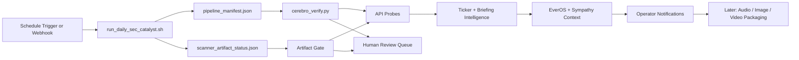

# Cerebro n8n Automation MVP

## Status

`n8n` is now vendored into the workspace at `vendor/n8n/n8n` and mounted as a local automation skill at `.agents/skills/n8n-automation-orchestrator/SKILL.md`.

The MVP goal is not "automate everything." The goal is to automate the safest, highest-value seams first:

- scanner cadence
- manifest and artifact gating
- operator intelligence retrieval
- memory and sympathy handoff
- multimodal follow-through only after truth gates pass

## Pod Workflow

## MVP Pods

### 1. Gatekeeper Pod

Owns run timing and release quality.

- Trigger premarket full runs
- Trigger intraday scanner refreshes
- Verify `pipeline_manifest.json`
- Reject empty scanner deploys using `scanner_artifact_status.json`
- Probe `/api/health` and `/api/universe` before declaring success

### 2. Intelligence Pod

Owns operator-facing enrichment.

- Fetch `/api/ticker/{symbol}`
- Fetch `/api/ai-summary/{ticker}`
- Fetch `/api/briefing`
- Branch when `model_metadata` indicates fallback or review-required state
- Attach sympathy and memory context

### 3. Notification Pod

Owns internal fan-out.

- Send internal alerts after gates pass
- Route failures into a human review queue
- Keep social and public posting behind explicit approval

### 4. Multimodal Pod

This is real, but later in the MVP.

- Voice briefings
- Screenshot cards for scanner/HUD state
- Video recap workflows

The multimodal pod should only consume already-validated outputs. It should never become the truth source.

## Workflow Pack

The initial workflow pack lives in `ops/n8n/workflows`:

- `cerebro_intraday_refresh_gatekeeper.json`
- `cerebro_premarket_pipeline.json`
- `cerebro_operator_intelligence_webhook.json`

## Deployment Shape

Use a self-hosted n8n container on the droplet and keep it off the public scanner/HUD hot path.

- bind n8n to `127.0.0.1:5678`
- proxy it separately if you want a browser UI
- mount `/opt/catalyst` into the n8n container so command nodes can run project scripts
- start with `EVEROS_ENABLED=0` in n8n-side workflows if you want a low-risk initial rollout

Reference files:

- `ops/n8n/docker-compose.yml.example`
- `ops/n8n/.env.example`

## Order Of Operations

1. Bring up n8n in Docker
2. Import the workflow JSON files
3. Adjust schedule nodes to match the scanner refresh contract
4. Test the intraday workflow first
5. Test the premarket full pipeline next
6. Only then attach notifications and multimodal outputs

## Safe MVP Boundary

The safe line is:

- automate orchestration
- automate validation
- automate internal enrichment

Do not let n8n own:

- raw scoring logic
- live HUD rendering logic
- truth generation for filings
- public posting without review
