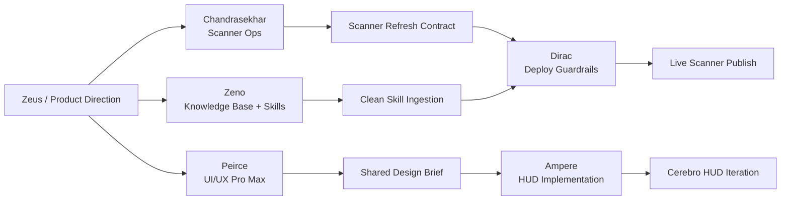

# Cerebro Scanner/UI Next Actions

## Current Truth

- Date: 2026-04-07
- Project phase: late Phase 1 / early Phase 2 MVP hardening
- Active domains: entity mapping, catalyst intelligence, macro/scoring support, operator workflow
- Live Scanner status: refreshing on the droplet, but only on a sparse schedule
- UI UX Pro Max status: ingested into the external skill stack at `~/skills/ui-ux-pro-max`
- Ruflo status on this machine: CLI works, but memory/database and config are not initialized

## What We Confirmed

### Scanner refresh

- The Scanner page is generated by `generate_seo_site.py`
- The generator is invoked by `run_daily_sec_catalyst.sh`
- The live droplet is not using a repo-local `systemd` timer for this workflow
- The active live schedule is a cron entry:

```text
5 8 * * 1-5 cd /opt/catalyst && bash run_daily_sec_catalyst.sh >> /var/log/catalyst.log 2>&1
```

- This means the main Scanner refresh currently runs once per weekday at `08:05 UTC`
- On April 7, 2026, live artifact timestamps showed the refresh did run:
  - `sec_catalyst_latest.csv` at `08:06 UTC`
  - `combined_priority.csv` at `08:07 UTC`
  - `docs/index.html` at `08:16 UTC`

### UI UX Pro Max

- The UI UX Pro Max repository was cloned into `~/skills/ui-ux-pro-max`
- A `SKILL.md` manifest was created
- `python3 ingest_skills.py` rebuilt the external `Cerebro_Knowledge_Base.txt`
- The ingest worked, but the current ingestion script is noisy because it re-ingests generated knowledge-base outputs and backup files

### Ruflo

- `npx ruflo@latest doctor` succeeded
- `npx ruflo@latest hooks route ...` succeeded, but only produced a generic `coder` recommendation
- `npx ruflo@latest memory search ...` failed with `Database not found`
- Conclusion: Ruflo can help later, but it is not yet hydrated enough to replace the current project execution board

## Ownership Map

- `Chandrasekhar`: Scanner operations, refresh cadence, live publish diagnostics
- `Peirce`: shared Scanner/HUD visual language and UI UX Pro Max application
- `Zeno`: skill ingestion, knowledge-base text, repo-skill curation, intake hygiene
- `Dirac`: deploy/reliability guardrails that support Scanner and Cerebro
- `Ampere`: HUD implementation once design decisions are locked

## Immediate Decision Gate

The Scanner is not in a pure outage state. The real problem is that the current live cadence is probably below product expectations.

Before changing code or cron, the team needs to pick one refresh contract:

1. `Premarket Daily`
   - One full refresh before market open
   - Lowest ops risk
   - Best if Scanner is primarily a morning briefing surface

2. `Intraday Hourly`
   - Premarket refresh plus hourly updates during market hours
   - Better for a live intelligence surface
   - Moderate ops and freshness complexity

3. `Event Driven`
   - Refresh on pipeline completion plus selected catalyst triggers
   - Best long-term UX
   - Highest implementation complexity

## Recommended Next Move

Pick `Intraday Hourly` as the MVP target, but execute it in two steps:

### Step 1: stabilize the schedule contract

- `Chandrasekhar` defines the exact Scanner freshness contract
- Proposed MVP contract:
  - weekday premarket full refresh
  - hourly refresh during US market hours
  - clear “Last refreshed” timestamp rendered on the Scanner page

### Step 2: clean the knowledge-base lane

- `Zeno` refactors `~/skills/ingest_skills.py` to skip:
  - generated `Cerebro_Knowledge_Base.txt`
  - backup `.txt` outputs
  - other low-signal generated artifacts
- This keeps future skill ingestion from bloating the external Cerebro knowledge base

### Step 3: turn UI UX Pro Max into an actual design brief

- `Peirce` writes a shared design brief for:
  - public Scanner landing surface
  - operator Cerebro HUD
- The brief should define:
  - typography direction
  - color system
  - glass/HUD usage rules
  - bento/grid usage rules
  - what is shared vs. what is unique between Scanner and Cerebro

## Visual Workflow



## Deliverables To Produce Next

1. `SCANNER_REFRESH_CONTRACT.md`
2. `SKILL_INGEST_HARDENING_PLAN.md`
3. `CEREBRO_SCANNER_DESIGN_BRIEF.md`

## Bottom Line

The next best move is not “add more agents.” It is to convert the new owners into three concrete deliverables:

- define the Scanner freshness contract
- clean the knowledge-base ingestion path
- turn UI UX Pro Max into a shared Scanner/HUD design brief
