# Cerebro Team Workflow

## Current Position

### Phase

- Current execution phase: `end Phase 3 / pre-Phase 4`
- Meaning:
  - `Phase 1` = reliability, scheduling, deploy, verification, canonical artifacts
  - `Phase 2` = interaction trust and operator-surface authority
  - `Phase 3` = truth/data integrity, quote hydration, deploy truth, local degraded-mode synthesis
  - `Phase 4` = launch gating, dark-launch helpers, and live operational memory

### Active Domains

- `Domain 1` = entity and taxonomy mapping
- `Domain 2` = macro layer
- `Domain 4` = event/catalyst intelligence
- early `Domain 5` = market mechanics such as short interest, options, sympathy

### Deferred Domains

- `Domain 3` = physical reality, geospatial, supply chain
- full universal graph expansion
- full Trade Architect execution engine
- mobile expression

## Team Topology

```mermaid
flowchart TD
    U["You / Product Integrator"] --> R["Reliability & Deploy"]
    U --> D["Data Contract"]
    U --> S["Scanner Ops & Refresh"]
    U --> H["Cerebro HUD Workflow"]
    U --> G["Scoring & Intelligence"]
    U --> K["Knowledge Base & Skills"]
    U --> MEM["Memory & Long-Context"]
    U --> KG["Knowledge Graph / Vault Intelligence"]
    U --> X["Design Systems / UI UX Pro Max"]
    U --> MD["Market Data Connectivity / Provider Strategy"]
    U --> MCP["MCP Command Center / Tactical Acquisition"]
    U --> NX["Code Graph / Nervous System"]

    R --> P["Daily Pipeline<br/>run_daily_sec_catalyst.sh"]
    R --> V["Verification<br/>cerebro_verify.py"]
    R --> L["Live Services / Restart Path"]

    D --> A["API Contract<br/>api_server.py"]
    D --> E["Canonical Entity Shape<br/>entity_master.json"]
    D --> PMAP["Producer Map"]

    S --> SEO["Public Scanner Site<br/>generate_seo_site.py"]
    S --> PUB["docs/index.html"]
    S --> SCH["Schedule / Trigger / Refresh Runbook"]

    H --> HUD["Cerebro HUD<br/>hud/src/CerebroHUD.jsx"]
    H --> WS["Live Feed Contract"]

    G --> MAC["Macro Layer"]
    G --> SI["Short Interest"]
    G --> SYM["Sympathy"]
    G --> OPT["Options / Flow"]

    K --> KB["Cerebro Knowledge Base Text"]
    K --> SK["Skill Inventory / Intake"]
    K --> DOC["Planning Doc Distillation"]

    MEM --> EVO["EverOS Operational Memory"]
    MEM --> MSA["MSA Research / Long-Context"]
    MEM --> MEMAPI["Memory-Enriched API Context"]

    KG --> GG["Graphify Project Graph"]
    KG --> WIKI["Wiki / Obsidian Vault"]
    KG --> TASKMAP["Task & Entity Discovery"]

    X --> DS["Shared Design System"]
    X --> SCANUX["Scanner UX"]
    X --> HUDUX["HUD UX"]

    MD --> CONN["Provider Connectivity Matrix"]
    MD --> AUTH["Auth / Key Strategy"]
    MD --> CRYPTO["Crypto & Prediction Market Expansion"]
    MD --> UNIFY["OpenBB / Unified Adapter Policy"]

    MCP --> GHM["GitHub MCP"]
    MCP --> FCM["Firecrawl MCP"]
    MCP --> DBM["SQLite / Postgres MCP"]
    MCP --> FTM["Fetch / Web MCP"]

    NX --> GNX["GitNexus MCP / Impact Graph"]
    NX --> GIR["Graph Integrity Reports"]
    NX --> BRT["Blast-Radius Discipline"]
```

## Current Owners

### Core MVP Owners

- `Dirac`
  - Reliability and deploy
  - Owns pipeline determinism, verification, restart order, and deploy sync

- `Mendel`
  - Data contract
  - Owns canonical entity/API contract and producer-consumer boundaries

- `Einstein`
  - Scoring and intelligence
  - Owns score semantics, macro, short-interest, sympathy, and options/flow composition

- `Ampere`
  - Cerebro HUD workflow
  - Owns desktop operator experience and HUD contract fit

- `Helmholtz`
  - Skill ingestion and research
  - Owns repo intake, skill inventory, and non-blocking expansion research

- `Mnemosyne`
  - Memory fabric and long-context intelligence
  - Owns the permanent `EverOS` + `MSA` lane across Scanner, HUD, deploy, and research

- `Graphify`
  - Knowledge graph and vault intelligence
  - Owns structural graphing across Cerebro code, docs, PDFs, screenshots, and markdown research

- `Minsky`
  - Market data connectivity and provider strategy
  - Owns provider selection, auth normalization, unified adapter policy, and expansion lanes such as crypto and prediction markets

- `Argus`
  - MCP command center and tactical data acquisition
  - Owns GitHub / Firecrawl / fetch / database / Google Search / Perplexity MCP wiring, config generation, and safe activation patterns across the Cerebro workspace

- `Hermes`
  - Workflow automation bus
  - Owns the n8n lane, workflow execution routing, webhook-safe orchestration, and the bridge between command-center agents and automation

## New Owners Added

### Knowledge Base and Skill Librarian

- `Zeno`
  - Handles the Cerebro knowledge-base text
  - Owns:
    - knowledge-base text and distilled intelligence artifacts
    - skill manifests and skill inventory
    - ingestion notes and repo-intake manifests
    - the bridge between brainstorming docs and reusable project intelligence

This is the right owner for:

- `Cerebro_Knowledge_Base.txt`
- `ingest_skills.py`-style workflows
- long-form distilled system knowledge
- converting raw docs into reusable internal intelligence

### Memory and Long-Context Intelligence

- `Mnemosyne`
  - Handles the permanent memory and long-context lane
  - Owns:
    - operational EverOS memory strategy
    - long-context MSA research strategy
    - memory-enriched API context surfaces
    - the rule that memory is permanent but not allowed to destabilize hot runtime paths

This is the right owner for:

- [everos_memory_client.py](/home/operator/.openclaw/workspace/everos_memory_client.py)
- [everos_pipeline_ingest.py](/home/operator/.openclaw/workspace/everos_pipeline_ingest.py)
- [CEREBRO_EVERMIND_INTEGRATION.md](/home/operator/.openclaw/workspace/CEREBRO_EVERMIND_INTEGRATION.md)
- [CEREBRO_MEMORY_AGENT_POLICY.md](/home/operator/.openclaw/workspace/CEREBRO_MEMORY_AGENT_POLICY.md)
- offline MSA evaluation and filing-bundle reasoning work

### Knowledge Graph and Vault Intelligence

- `Graphify`
  - Handles project graphing, vault curation, and cross-source structure discovery
  - Owns:
    - [vendor/graphify](/home/operator/.openclaw/workspace/vendor/graphify)
    - [ops/graphify_workspace.sh](/home/operator/.openclaw/workspace/ops/graphify_workspace.sh)
    - [.graphifyignore](/home/operator/.openclaw/workspace/.graphifyignore)
    - [.agents/skills/graphify-agent/SKILL.md](/home/operator/.openclaw/workspace/.agents/skills/graphify-agent/SKILL.md)
    - [CEREBRO_GRAPHIFY_AGENT_POLICY.md](/home/operator/.openclaw/workspace/CEREBRO_GRAPHIFY_AGENT_POLICY.md)

This is the right owner for:

- proactive entity discovery across notes and code
- vault/wiki generation from mixed project sources
- “connect the dots” analysis before architecture or planning work
- task extraction from brainstorming material

### Scanner Ops and Refresh

- `Chandrasekhar`
  - Handles the Scanner site as an operational product surface
  - Owns:
    - [generate_seo_site.py](/home/operator/.openclaw/workspace/generate_seo_site.py)
    - the scanner-side publish/refresh path
    - schedule/trigger debugging
    - refresh runbooks and schedule truth

Important note:

- the scanner generator is invoked by [run_daily_sec_catalyst.sh](/home/operator/.openclaw/workspace/run_daily_sec_catalyst.sh#L184)
- but there are no local `.timer` files in this repo
- so the refresh problem is most likely an ops/scheduler ownership issue, not a missing generator

### Design Systems / UI UX Pro Max

- `Peirce`
  - Handles shared design language across both Scanner and Cerebro
  - Owns:
    - design system rules
    - tactical/HUD visual direction
    - cross-surface UI consistency
    - the home for the `UI UX Pro Max` skill

This owner should be the one “behind” the premium webpage design direction.

### Market Data Connectivity / Provider Strategy

- `Minsky`
  - Handles the market-data and external provider-integration lane
  - Owns:
    - [CEREBRO_MARKET_DATA_CONNECTIVITY_MATRIX.md](/home/operator/.openclaw/workspace/CEREBRO_MARKET_DATA_CONNECTIVITY_MATRIX.md)
    - provider selection and auth normalization
    - OpenBB-first adapter policy where it reduces bespoke code
    - crypto / prediction-market connectivity expansion
    - redundancy, degraded-mode fallback, and provider-health planning

This is the right owner for:

- reducing data bottlenecks
- deciding which feeds should be direct vs OpenBB-managed
- adding crypto without creating connector sprawl
- formalizing the provider/env-var contract across Scanner, HUD, and automation

### MCP Command Center / Tactical Acquisition

- `Argus`
  - Handles the Model Context Protocol lane for Cerebro
  - Owns:
    - [CEREBRO_MCP_COMMAND_CENTER.md](/home/operator/.openclaw/workspace/CEREBRO_MCP_COMMAND_CENTER.md)
    - [ops/mcp/README.md](/home/operator/.openclaw/workspace/ops/mcp/README.md)
    - [ops/mcp/build_cerebro_mcp_config.py](/home/operator/.openclaw/workspace/ops/mcp/build_cerebro_mcp_config.py)
    - [ops/mcp/check_cerebro_mcp_stack.py](/home/operator/.openclaw/workspace/ops/mcp/check_cerebro_mcp_stack.py)
    - the wrapper launchers in [ops/mcp](/home/operator/.openclaw/workspace/ops/mcp)

This is the right owner for:

- GitHub MCP activation
- Firecrawl tactical acquisition setup
- Google Search and Perplexity research-lane intake
- SQLite/Postgres MCP routing
- env-safe MCP config generation
- future curated MCP server intake

### Workflow Automation Bus

- `Hermes`
  - Handles workflow-bus orchestration for Cerebro
  - Owns:
    - n8n workflow routing
    - execution handoff between command-center agents and automations
    - webhook-safe orchestration boundaries
    - the rule that automation should be explicit, observable, and not create shadow runtime paths

This is the right owner for:

- n8n MCP activation
- workflow execution and automation fan-out
- wiring agent outputs into scheduled or triggered automation surfaces
- keeping automation logic out of hot Scanner/HUD runtime paths

### Code Graph / Nervous System

- `Ariadne`
  - Handles GitNexus topology mapping and graph integrity for launch-critical changes
  - Owns:
    - [CEREBRO_GITNEXUS_NERVOUS_SYSTEM.md](/home/operator/.openclaw/workspace/CEREBRO_GITNEXUS_NERVOUS_SYSTEM.md)
    - [.agents/skills/gitnexus-code-graph/SKILL.md](/home/operator/.openclaw/workspace/.agents/skills/gitnexus-code-graph/SKILL.md)
    - [ops/mcp/run_gitnexus_mcp.sh](/home/operator/.openclaw/workspace/ops/mcp/run_gitnexus_mcp.sh)
    - the GitNexus graph index under `/home/operator/.openclaw/workspace/.gitnexus`

This is the right owner for:

- mapping every unknown-entry edge in the taxonomy pipeline
- placing interceptors at the lowest-latency safe hook
- validating that new gates do not isolate critical clusters
- publishing graph-integrity reports before risky merges

## Who Handles What

### Who handles the Cerebro knowledge-base text?

- `Zeno`

### Who is behind the UI/UX Pro Max design direction?

- `Peirce`

### Can the UI/UX owner modify both the Scanner and Cerebro?

- Yes
- But only as the design systems owner
- That means:
  - yes for layout, interaction patterns, visual language, shared components, surface clarity
  - no for scheduling, backend contracts, or scoring logic

### Do we have an agent for the Scanner?

- Yes now: `Chandrasekhar`
- This is the right owner for the scanner webpage not refreshing as scheduled

## Routing Guide

### Send to `Chandrasekhar`

- scanner page not updating
- publish cadence problems
- schedule/debug questions
- public site generation issues

### Send to `Peirce`

- redesign scanner homepage
- redesign Cerebro HUD panels
- glassmorphism / bento / tactical HUD design work
- unify scanner and HUD visual language

### Send to `Zeno`

- update the knowledge base
- ingest a new skill repo
- maintain `Cerebro_Knowledge_Base.txt`
- distill docs into reusable project memory

### Send to `Mnemosyne`

- EverOS persistence and retrieval design
- memory-enriched API surfaces
- sympathy/follow-through memory strategy
- MSA evaluation backlog
- long-context filing or event-corpus reasoning

### Send to `Minsky`

- market-data provider research
- connector redundancy and fallback planning
- macro/options/equities/crypto feed expansion
- auth normalization and env-var policy
- deciding where OpenBB should replace bespoke adapters
- prediction-market and crypto roadmap ingestion

### Send to `Argus`

- MCP config generation
- GitHub / Firecrawl MCP setup
- Google Search / Perplexity MCP setup
- SQLite or Postgres MCP routing
- fetch/web acquisition MCP setup
- tactical acquisition server intake

### Send to `Hermes`

- n8n MCP setup
- workflow bus orchestration
- execution routing and webhook-safe automation flows
- command-center to automation handoff design

### Send to `Ariadne`

- GitNexus graph refreshes and topology mapping
- taxonomy pipeline unknown-entry tracing
- blast-radius checks before changing shared builders
- EverOS gate integrity and cluster-isolation checks
- launch-readiness graph reports for long-tail recovery work

### Send to `Graphify`

- graph the repo or a research corpus
- generate an Obsidian-style vault or wiki
- map relationships across code, docs, PDFs, and images
- extract task clusters from notes before updating execution docs

### Send to `Ampere`

- HUD workflow problems
- operator clarity
- widget/panel structure
- frontend contract assumptions inside the HUD

### Send to `Mendel`

- API shape changes
- canonical fields
- entity schema
- producer/consumer confusion

### Send to `Dirac`

- deploy/restart problems
- pipeline verification
- service health
- manifest and release gating

## Suggested Next Operational Move

The next practical split should be:

1. `Chandrasekhar` investigates why the scanner webpage is not refreshing on schedule
2. `Zeno` becomes the owner of the Cerebro knowledge-base text and skill-ingestion workflow
3. `Peirce` becomes the design owner for the proposed `UI UX Pro Max` skill across Scanner and Cerebro
4. `Minsky` becomes the owner of the market-data connectivity matrix and the next provider-expansion plan
5. `Argus` becomes the owner of MCP command-center activation and tactical acquisition tooling
6. `Hermes` becomes the owner of the n8n workflow bus and automation orchestration lane
7. `Ariadne` becomes the owner of GitNexus graph integrity, topology mapping, and blast-radius discipline for launch-critical changes

That gives you:

- one owner for content intelligence
- one owner for public scanner operations
- one owner for premium front-end design direction
